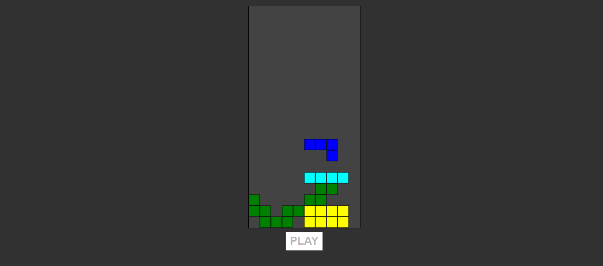

# JOGO DO TETRIS 02
👨‍💻JOGO DO TETRIS COM HTML, CSS E JS.

  

## DESCRIÇÃO:
**Tetris** é um jogo de quebra-cabeça onde peças (ou "tetriminos") caem do topo da tela e o jogador deve movê-las e girá-las para formar linhas horizontais completas. Quando uma linha é completada, ela desaparece, e o jogador ganha pontos. O objetivo é evitar que as peças se acumulem até o topo da tela. O jogo termina quando não há mais espaço para novas peças.

## JOGANDO:
1. **Iniciar o Jogo**:
   - Clique no botão **PLAY** para começar uma nova partida.

2. **Controles**:
   - **Seta para a Esquerda** (←): Move a peça ativa para a esquerda.
   - **Seta para a Direita** (→): Move a peça ativa para a direita.
   - **Seta para Baixo** (↓): Move a peça ativa para baixo.
   - **Seta para Cima** (↑): Gira a peça ativa.
   - **Espaço**: Faz a peça cair rapidamente até o fundo da tela (drop).

3. **Objetivo**:
   - O objetivo é preencher linhas horizontais inteiras na tela com blocos. Quando uma linha é preenchida, ela desaparece, e você ganha pontos.
   - Continue preenchendo linhas para aumentar sua pontuação e evitar que as peças se acumulem até o topo da tela.

4. **Perda**:
   - O jogo termina quando uma nova peça não pode ser colocada porque a tela está cheia. A mensagem de game over aparece e o botão **PLAY** será reativado para iniciar um novo jogo.

## NÃO SABE?
- Entendemos que para manipular arquivos em `HTML`, `CSS` e outras linguagens relacionadas, é necessário possuir conhecimento nessas áreas. Para auxiliar nesse aprendizado, oferecemos cursos gratuitos disponíveis:
* [CURSO DE HTML E CSS](https://github.com/VILHALVA/CURSO-DE-HTML-E-CSS)
* [CURSO DE JAVASCRIPT](https://github.com/VILHALVA/CURSO-DE-JAVASCRIPT)
* [CURSO DE CANVAS](https://github.com/VILHALVA/CURSO-DE-CANVAS)
* [CONFIRA MAIS CURSOS](https://github.com/VILHALVA?tab=repositories&q=+topic:CURSO)

## CREDITOS:
- [PROJETO CRIADO PELO "dionyziz"](https://github.com/dionyziz/canvas-tetris)
- [PROJETO EDITADO PELO VILHALVA](https://github.com/VILHALVA)
